# Chapter 1: Neural Networks

**Difficulty:** Intermediate | **Prerequisites:** Calculus, Linear Algebra
{: .fs-6 .fw-300 }

Welcome to the engine room of modern AI. Neural networks are the computational heart of technologies that feel like magic, from self-driving cars to the large language models that can write poetry and code. This chapter peels back the curtain, revealing the elegant mathematical principles that allow these systems to learn from data and perform complex tasks. We'll build a solid foundation, starting with intuition and progressively adding the technical layers needed to understand the advanced architectures discussed later in this book.

---

## An Intuitive Introduction to Neural Networks

Before diving into the math, let's start with a simple analogy. Imagine you're trying to teach a machine to recognize a picture of a cat. You, as a human, do this instantly. You've seen thousands of cats and your brain has learned to identify "cat-like" features: pointy ears, whiskers, fur, specific eye shapes.

A neural network learns in a conceptually similar way. It's a system of simple, interconnected computational "neurons" that work together to find patterns. We show it thousands of pictures of cats (and non-cats), and with each example, it slightly adjusts the connections between its neurons. A connection that helps correctly identify a cat gets stronger, while a connection that leads to a wrong guess gets weaker. After enough training, the network has "learned" a complex set of features that, together, define a cat.

```mermaid
graph LR
    A["Cat Images<br/>🐱🐱🐱"] --> B["Neural Network<br/>🧠"]
    B --> C["Cat Features<br/>👁️ ears<br/>😸 whiskers<br/>🐾 patterns"]
    C --> D["Classification<br/>✅ Cat<br/>❌ Not Cat"]
    
    style A fill:#e1f5fe
    style B fill:#f3e5f5
    style C fill:#e8f5e8
    style D fill:#fff3e0
```

At its core, a neural network is a powerful and flexible pattern-finding machine. It's a mathematical function that can, in theory, approximate *any* continuous function. This is known as the **Universal Approximation Theorem**, and it's why neural networks are such a powerful tool for a vast range of problems.

## The Core Components: From Neurons to Networks

A network's power comes from combining simple parts into a complex, hierarchical system. Let's break down these fundamental building blocks.

### The Neuron: The Basic Computational Unit

A single neuron is the atomic unit of a neural network. It's a simple calculator that performs a few key steps:

1.  **Receives Inputs**: It takes in one or more numerical inputs.
2.  **Computes a Weighted Sum**: Each input is multiplied by a **weight**, which signifies the input's importance. The neuron sums up all these weighted inputs.
3.  **Adds a Bias**: A **bias** term is added to the sum. This is like a tunable offset that allows the neuron to shift its output, giving it more flexibility.
4.  **Applies an Activation Function**: The result is passed through a non-linear **activation function**. This is a critical step that allows the network to learn complex, non-linear patterns. Without it, the entire network would just be a simple linear equation.

```mermaid
graph LR
    X1["x₁"] --> W1["w₁"]
    X2["x₂"] --> W2["w₂"]
    X3["x₃"] --> W3["w₃"]
    
    W1 --> SUM["Σ(wᵢxᵢ) + b"]
    W2 --> SUM
    W3 --> SUM
    
    B["bias (b)"] --> SUM
    SUM --> ACT["σ(z)"]
    ACT --> OUT["output (a)"]
    
    style SUM fill:#e3f2fd
    style ACT fill:#f3e5f5
    style OUT fill:#e8f5e8
```

Mathematically, the output (`a`) of a single neuron is:

**a = σ(Σᵢ wᵢ × xᵢ + b)**

Where `xᵢ` are the inputs, `wᵢ` are the weights, `b` is the bias, and `σ` (sigma) is the activation function.

### Activation Functions: Introducing Non-linearity

Activation functions are the secret sauce. They introduce non-linearity, allowing networks to model relationships that aren't just straight lines.

**Common Activation Functions:**

*   **ReLU (Rectified Linear Unit)**: `f(x) = max(0, x)`. The de-facto standard. It's simple and efficient but can sometimes "die" (stop outputting anything but zero).
*   **Sigmoid**: `f(x) = 1 / (1 + e⁻ˣ)`. Squashes values to a range between 0 and 1. Useful for outputs that represent probabilities, but it has a tendency to cause "vanishing gradients," a problem we'll discuss later.
*   **Tanh (Hyperbolic Tangent)**: `f(x) = (eˣ - e⁻ˣ) / (eˣ + e⁻ˣ)`. Similar to sigmoid but squashes values to a range between -1 and 1. It's zero-centered, which can be helpful.
*   **GELU (Gaussian Error Linear Unit)**: A smoother, more sophisticated function that has become popular in transformer models.

> **📊 Image Placeholder**: *Activation Functions Comparison*
> 
> Create a 2x2 grid plot showing:
> - Top left: ReLU function (sharp corner at 0, linear for x > 0)
> - Top right: Sigmoid function (S-shaped curve, output 0-1)
> - Bottom left: Tanh function (S-shaped curve, output -1 to 1)
> - Bottom right: GELU function (smooth ReLU-like curve)
> 
> X-axis: input values (-5 to 5), Y-axis: function output values

### Layers: Stacking Neurons for Abstract Representations

A single neuron isn't very powerful. The magic happens when we organize them into **layers**.

*   **Input Layer**: This isn't really a computational layer. It just holds the raw input data (e.g., the pixel values of an image).
*   **Hidden Layers**: These are the workhorses. Each layer receives input from the previous layer and produces an output for the next. As data passes through the hidden layers, the network learns to identify increasingly abstract features. The first layer might learn to detect simple edges, the next might combine edges to find shapes like eyes and ears, and a deeper layer might combine those to identify a cat's face.
*   **Output Layer**: The final layer that produces the network's prediction (e.g., the probability that the image contains a cat).

```mermaid
graph LR
    subgraph "Input Layer"
        I1["x₁"]
        I2["x₂"]
        I3["x₃"]
        I4["x₄"]
    end
    
    subgraph "Hidden Layer 1"
        H1["h₁⁽¹⁾"]
        H2["h₂⁽¹⁾"]
        H3["h₃⁽¹⁾"]
    end
    
    subgraph "Hidden Layer 2"
        H4["h₁⁽²⁾"]
        H5["h₂⁽²⁾"]
    end
    
    subgraph "Output Layer"
        O1["ŷ"]
    end
    
    I1 --> H1
    I1 --> H2
    I1 --> H3
    I2 --> H1
    I2 --> H2
    I2 --> H3
    I3 --> H1
    I3 --> H2
    I3 --> H3
    I4 --> H1
    I4 --> H2
    I4 --> H3
    
    H1 --> H4
    H1 --> H5
    H2 --> H4
    H2 --> H5
    H3 --> H4
    H3 --> H5
    
    H4 --> O1
    H5 --> O1
    
    style I1 fill:#e3f2fd
    style I2 fill:#e3f2fd
    style I3 fill:#e3f2fd
    style I4 fill:#e3f2fd
    style H1 fill:#f3e5f5
    style H2 fill:#f3e5f5
    style H3 fill:#f3e5f5
    style H4 fill:#f3e5f5
    style H5 fill:#f3e5f5
    style O1 fill:#e8f5e8
```

The computation for an entire layer can be written efficiently using matrix multiplication:

**h^(ℓ) = σ(W^(ℓ) × h^(ℓ-1) + b^(ℓ))**

This equation describes how the activations of one layer (`h^(ℓ-1)`) are transformed into the activations of the next layer (`h^(ℓ)`) using a weight matrix (`W^(ℓ)`) and a bias vector (`b^(ℓ)`).

## How Neural Networks Learn: The Training Loop

"Training" a network means finding the optimal values for all its weights and biases to solve a specific task. This is achieved through an iterative process called the **training loop**.

1.  **Forward Propagation**: We feed the input data into the network and let it flow through the layers to generate a prediction.
2.  **Loss Calculation**: We compare the network's prediction to the true target using a **loss function**. This function outputs a single number (the "loss" or "error") that tells us how wrong the network was.
3.  **Backward Propagation (Backpropagation)**: This is the core of learning. Using calculus (specifically, the chain rule), the algorithm calculates the gradient of the loss with respect to every single weight and bias in the network. The gradient tells us the direction and magnitude to change each parameter to reduce the error.
4.  **Parameter Update**: An **optimizer** uses these gradients to update the weights and biases, nudging them in the right direction.

This four-step process is repeated thousands or millions of times, with batches of data, until the network's predictions are accurate enough.

### Loss Functions: Quantifying Error

The choice of loss function is tailored to the task:

*   **Mean Squared Error (MSE)**: Used for regression tasks where the output is a continuous value (e.g., predicting a house price).
*   **Cross-Entropy Loss**: The standard for classification tasks. It measures the dissimilarity between the predicted probabilities and the true class labels.

### Optimization Algorithms: Steering the Learning Process

The optimizer's job is to update the parameters based on the gradients computed during backpropagation.

*   **Stochastic Gradient Descent (SGD)**: The simplest optimizer. It updates parameters using the gradient from a single example or a small batch. It can be slow and noisy.
*   **Adam (Adaptive Moment Estimation)**: The go-to optimizer for most deep learning tasks. It adapts the learning rate for each parameter individually and uses momentum (an accumulation of past gradients) to speed up convergence.
*   **AdamW**: An improved version of Adam that handles weight decay (a regularization technique) more effectively, often preferred for training transformers.

The **learning rate** is a crucial hyperparameter that controls the step size of each update. Too large, and the optimizer might overshoot the optimal solution. Too small, and training will be painfully slow. **Learning rate scheduling**, where the learning rate is adjusted over the course of training, is a common technique to achieve better results.

```mermaid
graph LR
    A["Current Weights"] --> B["Gradient Calculation<br/>∇L(w)"]
    B --> C["Optimizer<br/>(SGD/Adam/AdamW)"]
    C --> D["Weight Update<br/>w = w - η∇L(w)"]
    D --> E["Updated Weights"]
    
    LR["Learning Rate (η)"] --> C
    
    style A fill:#e3f2fd
    style B fill:#f3e5f5
    style C fill:#fff3e0
    style D fill:#e8f5e8
    style E fill:#e0f2f1
```

## Building Robust Models: Regularization and Best Practices

A powerful network can have millions of parameters. This gives it the capacity to learn complex patterns, but also to "cheat" by simply memorizing the training data. This is called **overfitting**. A model that has overfit performs well on data it has seen but fails to generalize to new, unseen data. **Regularization** techniques are designed to combat this.

> **📈 Image Placeholder**: *Overfitting vs. Good Generalization*
> 
> Create a learning curves plot showing:
> - X-axis: Training epochs/iterations
> - Y-axis: Loss/Error
> - Two scenarios side by side:
>   - Left: Overfitting (training loss decreases, validation loss increases after some point)
>   - Right: Good generalization (both training and validation loss decrease together)
> - Use different colors for training vs validation curves
> - Add annotations pointing out the divergence point in overfitting scenario

### Common Regularization Techniques

*   **L1 and L2 Regularization**: Adds a penalty to the loss function based on the size of the weights. This discourages the network from relying on any single connection too heavily.
*   **Dropout**: During training, randomly sets a fraction of neuron activations to zero at each update step. This forces the network to learn redundant representations and prevents neurons from co-adapting too much.
*   **Batch Normalization**: Normalizes the inputs to each layer to have a mean of zero and a standard deviation of one. This stabilizes training, allows for higher learning rates, and provides a slight regularization effect.
*   **Early Stopping**: Monitor the model's performance on a separate validation set during training and stop when performance stops improving.

### The Importance of Initialization

Initializing weights correctly is crucial for stable training. Poor initialization can lead to vanishing or exploding gradients. **Xavier/Glorot** and **He initialization** are common schemes designed to maintain signal variance as it propagates through the network.

## A Glimpse at Network Architectures

While all networks are built from neurons and layers, their topology—how they are connected—is specialized for different data types.

*   **Feedforward Networks (Fully Connected)**: The simplest topology, where every neuron in one layer connects to every neuron in the next. They are general-purpose approximators, good for tabular data.
*   **Convolutional Neural Networks (CNNs)**: The superstars of computer vision. They use special convolutional layers with shared weights to detect local features in grid-like data (like images) in a way that is translation-invariant.
*   **Recurrent Neural Networks (RNNs)**: Designed for sequential data like text or time series. They have connections that loop back on themselves, giving them a form of "memory" to process inputs in context.
*   **Residual Networks (ResNets)**: A key innovation that uses "skip connections" to allow gradients to bypass layers. This makes it possible to train extremely deep networks without suffering from the vanishing gradient problem.

## Common Training Challenges

Training neural networks is part art, part science. Here are some common dragons you might encounter:

*   **Vanishing & Exploding Gradients**: In deep networks, gradients can become exponentially small (vanish) or large (explode) as they are propagated backward. This can grind learning to a halt. Solutions include proper initialization, residual connections, and gradient clipping.
*   **Dead Neurons**: ReLU neurons can get stuck in a state where they only output zero. Using variants like Leaky ReLU can help.
*   **Hyperparameter Tuning**: Finding the right architecture, learning rate, and regularization strength can be a long process of trial and error.

> **📊 Image Placeholder**: *Gradient Flow Problems*
> 
> Create a visualization showing:
> - Top: Normal gradient flow through network layers (consistent gradient magnitudes)
> - Middle: Vanishing gradients (gradients getting exponentially smaller in deeper layers)
> - Bottom: Exploding gradients (gradients getting exponentially larger)
> - Use color intensity or arrow thickness to represent gradient magnitude
> - Show layer depth on x-axis, gradient magnitude on y-axis

## Conclusion

Neural networks are not magic; they are elegant mathematical systems built on a few core principles. This chapter has provided a map of the foundational concepts:

-   Networks are built from simple, interconnected **neurons** organized in **layers**.
-   **Non-linear activation functions** are what give networks their power to learn complex patterns.
-   Learning is an iterative process of **forward propagation**, **loss calculation**, **backpropagation**, and **parameter updates** driven by an optimizer.
-   **Regularization** is crucial to prevent **overfitting** and ensure the model generalizes to new data.
-   Different **architectures** (CNNs, RNNs) are specialized for different types of data.

Understanding these fundamentals is the launchpad for the rest of this book. With this foundation, you are ready to explore the transformer architectures that power modern large language models.

---

## Exercises

1.  **Conceptual Understanding**
    -   Explain in your own words why non-linear activation functions are necessary. What would happen if a deep network used only linear activations?
    -   Derive the gradient of a single neuron with respect to its weights and bias, assuming a sigmoid activation function and MSE loss.

2.  **Implementation**
    -   Implement a simple feedforward network from scratch using only NumPy.
    -   Build a training loop with backpropagation for a binary classification task on synthetic data.

3.  **Experimentation**
    -   Train a simple network and compare the performance of different activation functions (e.g., ReLU vs. Sigmoid vs. Tanh).
    -   Investigate the effect of network depth and width on performance and overfitting.
    -   Apply Dropout to your network and observe its effect on the training and validation loss curves.

4.  **Analysis**
    -   Visualize the decision boundary learned by a network on a 2D classification problem. How does it change as the network trains?
    -   Intentionally cause a "dead ReLU" problem. How would you detect and fix it?

---

## Further Reading

### Essential Papers
-   Rumelhart, D. E., Hinton, G. E., & Williams, R. J. (1986). "Learning representations by back-propagating errors." *Nature*.
-   Hornik, K., Stinchcombe, M., & White, H. (1989). "Multilayer feedforward networks are universal approximators." *Neural Networks*.
-   Kingma, D. P., & Ba, J. (2014). "Adam: A method for stochastic optimization." *arXiv*.

### Online Resources
-   **[3Blue1Brown Neural Network Series](https://www.youtube.com/playlist?list=PLZHQObOWTQDNU6R1_67000Dx_ZCJB-3pi)**: An outstanding visual and intuitive introduction.
-   **[Andrej Karpathy's Neural Networks: Zero to Hero](https://www.youtube.com/playlist?list=PLAqhIrjkxbuWI23v9cThsA9GvCAUhRvKZ)**: A hands-on, code-first guide to building neural networks from scratch.
-   **[The Deep Learning Book](https://www.deeplearningbook.org/)**: The definitive, comprehensive textbook on the subject.

### Practical Tutorials
-   **[PyTorch Tutorials](https://pytorch.org/tutorials/)**: Official documentation and guides for the PyTorch framework.
-   **[Karpathy's Recipe for Training Neural Networks](https://karpathy.github.io/2019/04/25/recipe/)**: A collection of hard-earned practical advice for training networks effectively.
