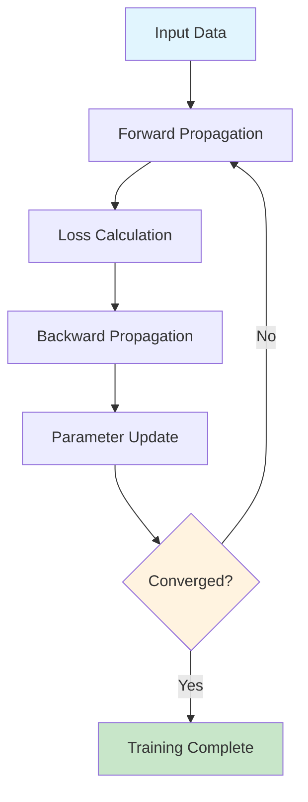

# The Learning Process: How Machines Actually Learn

## Why This Section Matters

Ever wondered how a neural network goes from being a random collection of numbers to something that can recognize your face in a photo? The answer lies in **training**—the magical process that transforms mathematical chaos into intelligent behavior. Understanding how machines learn isn't just academic curiosity; it's the foundation that will help you debug training issues, choose the right optimization strategies, and build more effective models.

## The "Aha!" Moment: The Cake Baker's Journey

Imagine you're learning to bake the perfect chocolate cake. Your first attempt is a disaster—too salty, burnt on the outside, raw in the middle. But instead of giving up, you have a brilliant system: after each attempt, a friend tastes your cake and gives you a "lousiness score" from 1 to 100. Your mission? Keep adjusting your recipe until that score gets as close to zero as possible.

This is exactly how neural networks learn! They start with random "recipes" (weights and biases), make predictions, get feedback on how wrong they are, and gradually refine their internal settings until they get really good at their job.

## The Building Blocks: Cost Functions and Loss

Before we can train anything, we need a way to measure how wrong our network is. Enter the **cost function** (or **loss function**)—the brutally honest critic that tells our network exactly how far off it is.

Think of it as a "lousiness score" that takes the network's prediction, compares it to the actual correct answer, and spits out a single number. A high number means the network is way off. A low number means it's getting close. A perfect score is zero.

> **Real-World Connection**
> 
> Imagine you're learning to bake a cake. Your first attempt is a disaster—too salty, burnt on the outside, raw on the inside. Your friend (the cost function) tastes it and says, "On a scale of 1 to 100, this is a 95 on the lousiness scale!" Your goal for the next attempt is to lower that score.

**Micro-Quiz**: What would a cost function return if a network perfectly predicts the correct answer? What about if it's completely wrong?

## Assembling the Pieces: Gradient Descent

How do we find the settings that get us the lowest cost? We use a brilliant algorithm called **Gradient Descent**. Let's stick with our cake analogy. Imagine the "cost function" is a giant, hilly landscape. The altitude represents the cost (how bad the cake is), and your position is defined by your recipe (the values of the weights and biases).

You're lost in the fog on this hilly terrain, and you want to get to the lowest possible point—the valley of perfect cake.

1. You start at a random spot (your first cake recipe is a wild guess).
2. You check your surroundings to find which direction is the *steepest way up*. This direction is called the **gradient**.
3. You take a small step in the **exact opposite direction**. Downhill. Always downhill.
4. Repeat. Step by step, you make your way down the hill, and eventually, you settle in a valley—a point where your cake recipe is optimized, and the lousiness score is at a minimum.

This is the core intuition of how a neural network learns. It's just a fancy way of rolling downhill.

**Prediction Exercise**: What do you think would happen if you took steps that were too large? What about if they were too small?

## The Secret Sauce: The Training Loop

This "rolling downhill" process is organized into a cycle called the **training loop**. It's a four-step dance that the network performs over and over again.



**Figure 2.1:** Neural Network Training Loop. The iterative four-step process of training: (1) Forward propagation, (2) Loss calculation, (3) Backward propagation (backpropagation), and (4) Parameter update, repeated until convergence.

### Forward Propagation
We give the network an input (like an image of a cat). It flows through all the layers, and the network makes a guess: "I'm 70% sure this is a dog."

### Loss Calculation
We compare the guess ("dog") to the truth ("cat") using our cost function. The function calculates the lousiness score. Ouch, it's high.

### Backward Propagation (Backpropagation)
This is the secret sauce. The network figures out *which* weights and biases were most responsible for the wrong guess. It's like a manager tracing a mistake back down the chain of command.

### Parameter Update
The optimizer takes this information and nudges all the weights and biases in the right direction—the "downhill" direction that will make the loss smaller next time.

This four-step dance is repeated, sometimes millions of times, with thousands of examples, until the network gets really good at its job.

**Reflection Prompt**: Think about a time you worked on a team project where something went wrong. How did you figure out the source of the problem? Does the idea of tracing the error backward resonate with that experience?

## The Secret Sauce: Backpropagation

Let's be honest, **Backpropagation** is where most people's eyes glaze over. It sounds complicated, and the math can look scary. But the core idea is surprisingly simple. It's about assigning blame.

At its heart, backpropagation relies on the **chain rule** from calculus. But forget the formulas for a second. Think of it like a gossip chain in reverse. The final loss is the juicy secret. Backpropagation starts at the end and works its way backward through the network, layer by layer. At each neuron, it asks, "How much did *you* contribute to the final mistake?" It calculates the exact amount of blame for every single weight and bias.

This "blame score" is the **gradient**. A positive gradient for a weight means that increasing this weight will make the final error *worse*. A negative gradient means increasing the weight will make the error *better*. So, we know exactly how to adjust it.

For a massive model like an LLM with billions of parameters, this backward pass of distributed blame is the *only* way to train it efficiently.

### The Blueprint: Computation Graphs

How does a framework like PyTorch or TensorFlow automate all this? It thinks in graphs.

Every calculation you perform—addition, multiplication, activation functions—is secretly recorded as a **computation graph**. This is just a flowchart where nodes are the numbers (or tensors) and the lines connecting them are the operations.

* The **forward pass** *builds* this graph.
* The **backward pass** (backpropagation) is just walking this graph *in reverse*, from the final loss back to every input, calculating the "blame score" (gradient) at each step.

This is the fundamental abstraction that makes modern deep learning possible. It allows the computer to automatically figure out the derivative for any crazy function you can dream up, as long as it's made of simple, known operations.

**Quick Challenge**: Try drawing a simple computation graph for the calculation: `y = (a + b) * c`. What would the backward pass look like?

## The Shortcut: Stochastic Gradient Descent (SGD)

Calculating the gradient using your *entire* dataset for every single tiny step is super accurate but also impossibly slow for large datasets. It's like tasting every cake in the world before deciding how to adjust your own recipe.

Instead, we use **Stochastic Gradient Descent (SGD)**. SGD estimates the gradient using just a small, random sample of the data, called a **mini-batch** (e.g., 32 or 64 examples instead of millions).

It's often described as a "drunk man stumbling downhill." The path isn't straight, and it's a bit wobbly, but it's *much* faster and often finds better solutions because the randomness helps it wiggle out of mediocre valleys in the cost landscape.

## Choosing Your Tools: Loss Functions & Optimizers

While the core recipe is the same, you have to pick the right tools for your specific task.

### Loss Functions

* **Mean Squared Error (MSE)**: The classic choice for regression tasks, where you're predicting a continuous number (e.g., the price of a house).
* **Cross-Entropy Loss**: The standard for classification tasks. It's brilliant at measuring how far off a predicted probability distribution is from the one-hot encoded truth.

### Optimization Algorithms

The optimizer is the chauffeur that uses the gradients to drive the parameters downhill. SGD is the basic strategy, but we have more advanced vehicles.

* **Adam (Adaptive Moment Estimation)**: The sophisticated, self-correcting GPS. It's the default choice for almost everything. It cleverly adapts the learning rate for each parameter and uses momentum (a memory of past gradients) to speed things up.
* **AdamW**: A slightly improved version of Adam that's particularly effective for transformers. It handles a regularization technique called "weight decay" more effectively.

The **learning rate** is the single most important knob to tune. It controls the size of the steps you take downhill. Too large, and you'll leap right over the valley. Too small, and you'll be training until the heat death of the universe.


**Figure 2.2:** Optimization Process in Neural Networks. The weight update mechanism showing how current weights are modified using gradients computed via backpropagation, processed by an optimizer, and scaled by the learning rate η.

**Code Demonstration**: Here's a simple example of how gradient descent works in practice:

```python
import numpy as np

def simple_gradient_descent():
    # Start with a random guess
    x = 10.0
    learning_rate = 0.1
    
    print("Starting position:", x)
    
    for i in range(10):
        # Calculate gradient (derivative of x^2 is 2x)
        gradient = 2 * x
        
        # Update: move in opposite direction of gradient
        x = x - learning_rate * gradient
        
        print(f"Step {i+1}: x = {x:.3f}, gradient = {gradient:.3f}")
    
    print(f"Final result: {x:.3f} (should be close to 0)")

simple_gradient_descent()
```

## A Final Thought

The learning process in neural networks is fundamentally about optimization—finding the best possible settings for millions of parameters. While the math can be intimidating, the core intuition is beautifully simple: make small adjustments in the direction that reduces error, repeat until you can't improve anymore.

The elegance of this approach is that it works for any differentiable function, making it incredibly versatile. Whether you're training a simple linear model or a massive transformer with billions of parameters, the same fundamental principles apply.

---

### Hands-on Projects

* **Build a Simple Neural Network from Scratch**: Implement forward and backward propagation for a 2-layer network using only NumPy
* **Visualize Gradient Descent**: Create an interactive plot showing how different learning rates affect convergence
* **Compare Optimizers**: Train the same model with SGD, Adam, and AdamW to see the differences
* **Debug Training Issues**: Practice identifying and fixing common problems like vanishing gradients and overfitting
* **Implement Mini-batch Training**: Modify a training loop to use stochastic gradient descent with configurable batch sizes

### Essential Papers

* **"Learning representations by back-propagating errors"** by Rumelhart, Hinton, and Williams (1986) - The original backpropagation paper
* **"Adam: A Method for Stochastic Optimization"** by Kingma and Ba (2014) - Introduction of the Adam optimizer
* **"Decoupled Weight Decay Regularization"** by Loshchilov and Hutter (2017) - The AdamW optimizer
* **"On the difficulty of training Recurrent Neural Networks"** by Pascanu et al. (2013) - Understanding vanishing gradients
* **"Deep Learning"** by LeCun, Bengio, and Hinton (2015) - Comprehensive overview of deep learning principles

---

**Ready for the next chapter?** Now that you understand how neural networks learn, let's explore the specific challenges that arise during training and how to overcome them.